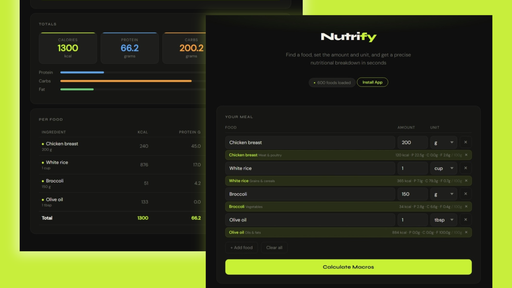

# Nutrify 🥗

A offline-first PWA macro calculator. Search 600 foods and get a full nutritional breakdown instantly.

## Live Preview 🌍

🔗 [Live Demo](https://beniamin-hekimian.github.io/nutrify)

## Features ✅

1. 🔍 Search **600 foods** with instant autocomplete
2. 📊 Full **macro breakdown** — calories, protein, carbs, fat
3. 📴 Works fully **offline** — no internet required
4. 📲 **Installable** as a PWA on mobile and desktop

## Screenshot 📸

## What I Learned 📚

1️⃣ **PWA Development**

- Configured `manifest.json` with icons, theme colors, display modes, and scope.
- Implemented a native **install prompt** with `beforeinstallprompt` that only appears when the app is not yet installed.

2️⃣ **Service Workers**

- Learned that a service worker is a background JS file that sits between the app and the network, intercepting every request.
- Implemented **install**, **activate**, and **fetch** lifecycle events.
- Used `skipWaiting()` and `clients.claim()` for instant activation on update.

3️⃣ **Vanilla JavaScript Architecture**

- Structured a clean JS app without any framework.
- Managed **dynamic DOM** generation and event delegation.
- Built a debounced **autocomplete search** from scratch.

4️⃣ **Nutrition Data & Unit Conversion**

- Curated a **600-item ingredient database** from USDA SR Legacy.
- Implemented unit-to-gram conversion for all common cooking units.
- All values calculated per 100g for accuracy and consistency.

## Technologies Used 🛠️

- 📦 **PWA** - Web App Manifest + Service Worker
- 📊 **USDA SR Legacy** - nutritional data source
- 🚀 **GitHub Pages** - Website hosting

## Conclusion 🎉

Developed by **Beniamin Hekimian** as a personal project to learn PWA development.
